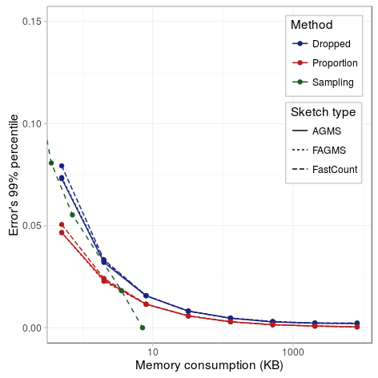
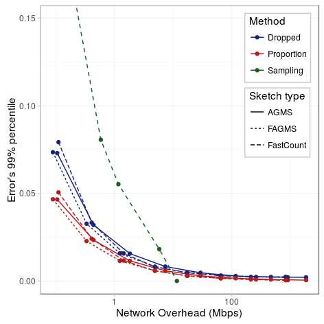
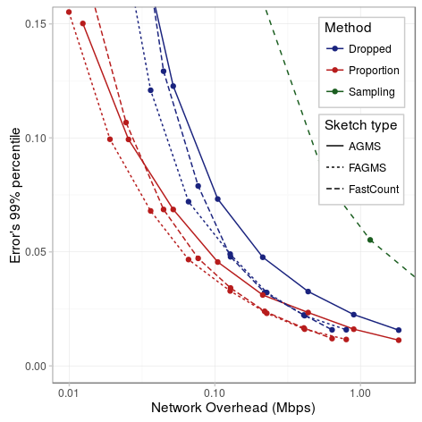
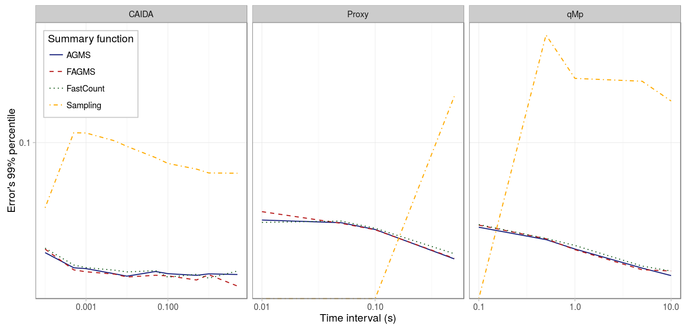
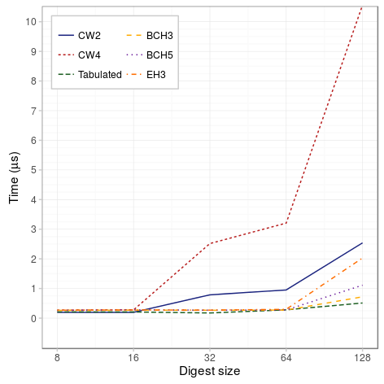
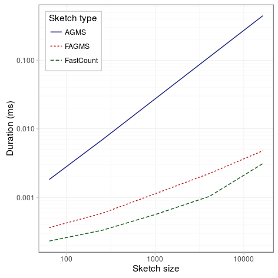
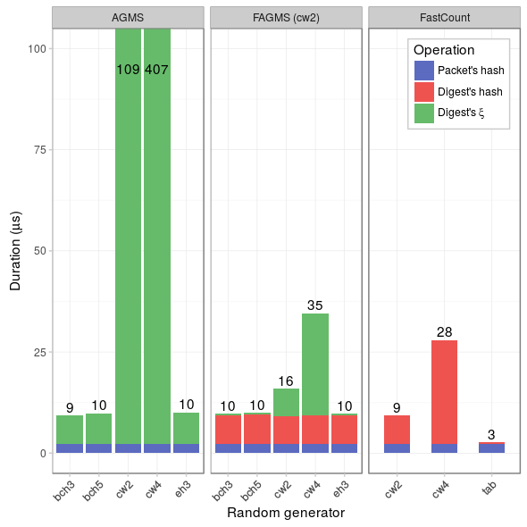

Finally, we compare the requirements in terms of memory, network bandwidth and CPU for the sketches.

## Memory

To study the cost in terms of memory, we consider that each sketch will be a matrix of counters and each will take 64 bits. We will compare the memory requirements with the costs that would take using sampling with digests of size 32 bits, and assuming that digests are buffered for the period of an interval.

|              Parameter |                   Value                  |
|-----------------------:|:----------------------------------------:|
|             _Interval_ |                   5 ms                   |
|     _Drop probability_ |                    10%                   |
|              _Columns_ |       {8,16,32,64,128,256,512,1024}      |
|                 _Rows_ |                  columns                 |
|          _Digest size_ |                    32                    |
|        _Hash function_ |                  default                 |
|          _Xi function_ |                  default                 |
|                 _Pcap_ |                   CAIDA                  |
|     _Average function_ |                   mean                   |
| _Sampling probability_ | {0.001, 0.005, 0.01, 0.05, 0.1, 0.5, 1.} |

On the figure above, we can see the 99% percentile of the error as a function of the memory requried. As we can see, sampling does not require much memory: even using a sampling probability of 100%, the memory cost is always below 10KB. On the other hand, in terms of memory, sketches are more expensive, but the required memory is always kept small and reasonable.

Similar results were obtained for the other pcap files and other percentile values.

## Network overhead

On the other hand, for the overhead, we consider that the sketches will be compressed, so that each counter will only use as many bits as necessary to code the largest value on the sketch.

|              Parameter |                   Value                  |
|-----------------------:|:----------------------------------------:|
|             _Interval_ |                   5 ms                   |
|     _Drop probability_ |                    10%                   |
|              _Columns_ |       {8,16,32,64,128,256,512,1024}      |
|                 _Rows_ |                  columns                 |
|          _Digest size_ |                    32                    |
|        _Hash function_ |                  default                 |
|          _Xi function_ |                  default                 |
|                 _Pcap_ |                   CAIDA                  |
|     _Average function_ |                   mean                   |
| _Sampling probability_ | {0.001, 0.005, 0.01, 0.05, 0.1, 0.5, 1.} |

Now we can see that for smaller sketches, they provide a better compromise between network overhead and accuracy than sampling: only when the sampling probability is above 50%, sampling obtains better results.

Also, as we can see, because AGMS updates every sketch, it tends to require more bits than Fast-AGMS and, when for bigger sketches, FastCount. FastCount, on the other hand, tends to need more bits than Fast-AGMS, but as the size of the sketch grows, because the number of bits is determined by the biggest counter and Fast-AGMS requires an extra bit to code for the sign of the counter, the roles reverse. This can be better seen for sketches of one row, as in the figure below. Another important remark from the figure below, is that FastCount and Fast-AGMS are more efficient in terms of bits when they only have a single row, since, on average, each counters will have been updated by less packets.

|              Parameter |                   Value                  |
|-----------------------:|:----------------------------------------:|
|             _Interval_ |                   5 ms                   |
|     _Drop probability_ |                    10%                   |
|              _Columns_ |       {8,16,32,64,128,256,512,1024}      |
|                 _Rows_ |                     1                    |
|          _Digest size_ |                    32                    |
|        _Hash function_ |                  default                 |
|          _Xi function_ |                  default                 |
|                 _Pcap_ |                   CAIDA                  |
|     _Average function_ |                   mean                   |
| _Sampling probability_ | {0.001, 0.005, 0.01, 0.05, 0.1, 0.5, 1.} |

But the results actually depend on the chosen time interval: the network bandwidth required by sampling is fixed regardless the time interval: it is only affected by the sampling probability and the data traffic throughput; but for sketches, longer time intervals will reduce the network overhead.

The figure below shows the 99% percentile for different time intervals and a sketch of size 16 by 16. Then, for each interval, the sampling probability has been adapted, so that the sampling overhead is in average as the sketches' one.

|              Parameter |                  Value                 |
|-----------------------:|:--------------------------------------:|
|             _Interval_ | {several values depending on the pcap} |
|     _Drop probability_ |                   10%                  |
|              _Columns_ |                   16                   |
|                 _Rows_ |                   16                   |
|          _Digest size_ |                   32                   |
|        _Hash function_ |                 default                |
|          _Xi function_ |                 default                |
|                 _Pcap_ |           {CAIDA, qMp, Proxy}          |
|     _Average function_ |                  mean                  |
| _Sampling probability_ |                 adapted                |

As we can see, for smaller intervals, sampling produces more accurate results because we can use sampling with 100% sampling probability and still consume the same network bandwidth than sketches, but as the interval becomes longer, sketching becomes more accurate. For the case of 10% of drop probability, sampling is a worse solution if there are more than 30 packets per time interval.

## CPU

Finally, we measured the time required to update a sketch on a Intel i5-3470 @ 3.20GHz using SHA256 to obtain the packet's digest.

The following figure measures the time consumed by each implementation of the pseudo-random functions. As we can see _cw4_ and _cw2_ are the most costly implementations, whereas the other four have similar execution times when the digest is 64 bits or less.

If we measure the update time for each sketch, we can see, as expected, that the AGMS is proportional to its size, whereas FastCount and Fast-AGMS are proportional to the number of rows.

The figure below shows the average cost for each of the functions that compose the sketch update. As we can see, because the sketch was 16 by 16, AGMS and Fast-AGMS take the same time, because cw2 takes quite a lot compared with the +-1 functions. However, using a tabulated hashing would help speed up the update of the sketches. For FastCount, using tabulated hashing the time is mainly constrained by the SHA256 function.

