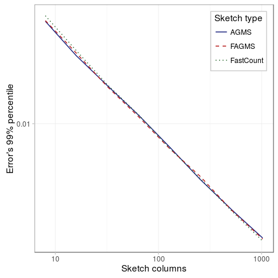
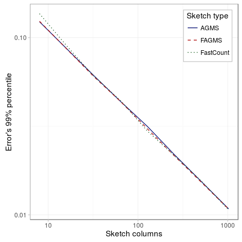
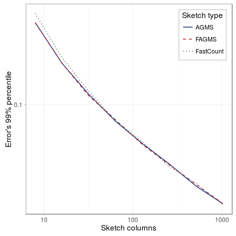

With the following experiments we will try to determine the effect of the number of columns on the standard error when estimating the proportion of dropped packets. We have considered three different scenarios, the first one has a smaller drop probability (10%), the second one has a large drop probability (60%) and the last one has a single row. As the figures below show, in all scenarios the percentile decreases with the number of columns, and it does so approximately proportional to the inverse of the square of the number of columns.

### Small drop probability

|          Parameter |             Value             |
|-------------------:|:-----------------------------:|
|          _Packets_ |              100              |
| _Drop probability_ |              10%              |
|          _Columns_ | {8,16,32,64,128,256,512,1024} |
|             _Rows_ |               32              |
|      _Digest size_ |               32              |
|    _Hash function_ |            default            |
|      _Xi function_ |            default            |
|             _Pcap_ |         CAIDA-no dups         |
| _Average function_ |              mean             |

### Large drop probability

|          Parameter |             Value             |
|-------------------:|:-----------------------------:|
|          _Packets_ |              100              |
| _Drop probability_ |              60%              |
|          _Columns_ | {8,16,32,64,128,256,512,1024} |
|             _Rows_ |               32              |
|      _Digest size_ |               32              |
|    _Hash function_ |            default            |
|      _Xi function_ |            default            |
|             _Pcap_ |         CAIDA-no dups         |
| _Average function_ |              mean             |

### Single row sketch

|          Parameter |             Value             |
|-------------------:|:-----------------------------:|
|          _Packets_ |              100              |
| _Drop probability_ |              10%              |
|          _Columns_ | {8,16,32,64,128,256,512,1024} |
|             _Rows_ |               1               |
|      _Digest size_ |               32              |
|    _Hash function_ |            default            |
|      _Xi function_ |            default            |
|             _Pcap_ |         CAIDA-no dups         |
| _Average function_ |              mean             |

