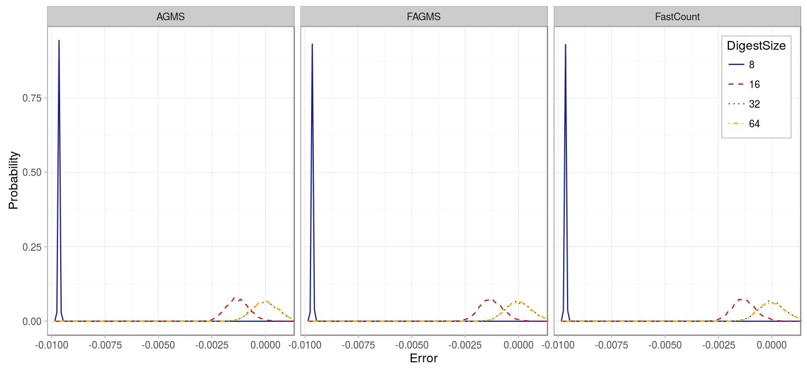
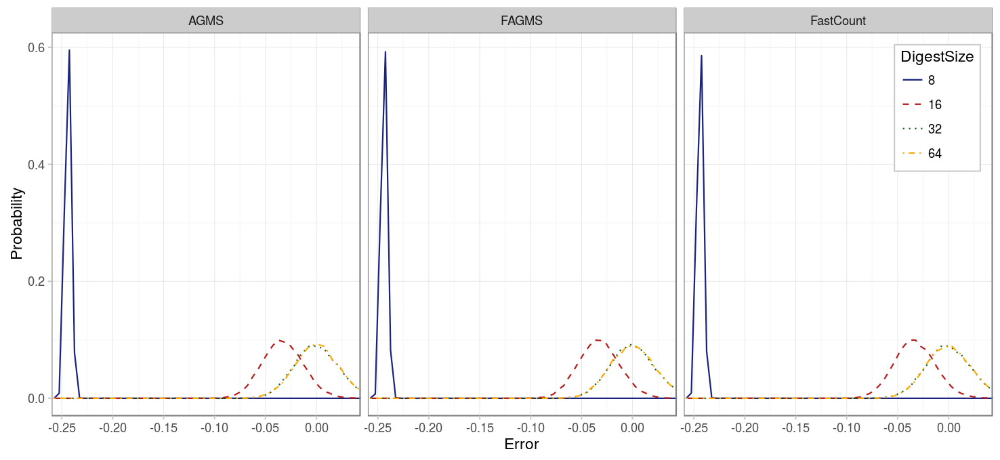

As we have seen when estimating the total number of different packets, the digest size must be chosen appropriately so that not so many packets will not have the same digest, despite being different packets. In the case of estimating a proportion we must consider two different cases:

* What happens when there are a lot of incoming packets but only a very small portion is dropped?
* What happens when there are a lot of incoming packets and also a lot of dropped packets?

To generate the data for these experiments use the following command:


# Point to your pcap
pcap=../pcaps/equinix-chicago.dirB.20130529-135900.UTC.anon.pcap 
for ID in {1..100}
do
python estimate-ratio.py digest.$ID $pcap --rows ROWS --columns COLUMNS \
  --hashFunction default --xiFunction default --numPackets PACKETS \
  --maxIter 100 --averageFunction mean --dropProbability PDROP
done


### Small number of packets dropped

First we will consider what happens when we drop only a small proportion of packets (1%). As we can see, in this case the total number of packets is being overestimated, specially for digests of size 8, but also slightly for those of size 16. Because the total number of incoming packets is being overestimated, the proportion of dropped packets is being underestimated.

|          Parameter |      Value      |
|-------------------:|:---------------:|
|          _Packets_ |      10000      |
| _Drop probability_ |        1%       |
|          _Columns_ |        32       |
|             _Rows_ |        32       |
|      _Digest size_ | {8, 16, 32, 64} |
|    _Hash function_ |     default     |
|      _Xi function_ |     default     |
|             _Pcap_ |      CAIDA      |
| _Average function_ |       mean      |

### Drop most of the packets

In our second experiment, we drop half of the packets, so that both the number of incoming and dropped packets are overestimated. However, because of the [quadratic characteristic of bias](../estimating-total/digest.html), the result is again an underestimated proportion of dropped packets.

|          Parameter |      Value      |
|-------------------:|:---------------:|
|          _Packets_ |      10000      |
| _Drop probability_ |       50%       |
|          _Columns_ |        32       |
|             _Rows_ |        32       |
|      _Digest size_ | {8, 16, 32, 64} |
|    _Hash function_ |     default     |
|      _Xi function_ |     default     |
|             _Pcap_ |      CAIDA      |
| _Average function_ |       mean      |

### Conclusions

When estimating the proportion of dropped packets, choosing the proper digest size is much more important than for the case of estimating the number of dropped packets because of two reasons:

* First, in this case we underestimate the proportion of dropped packets, instead of overestimating it. As a consequence, we are more likely to confuse faulty nodes with correct ones.
* Secondly, in this case we are not only influenced by the number of dropped packets, which tends to be small, but also by the number of total packets, which in general will be much higher, and the digest size must adapt to avoid collisions in such case.
