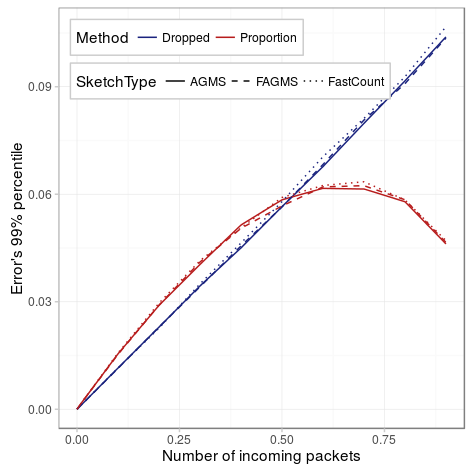

Now, we consider different values of the value being estimated, the drop probability. For this case, we will consider that we can estimate the drop probability in two different ways:

1. __Proportion__: We make no assumptions and estimate the drop probability estimating both the incoming packets and number of different packets using a sketch, and then divide them.
2. __Dropped__: We assume that we know the number of incoming packets, so we only need to estimate the dropped packets and divide by the number of incoming packets. This could be achieved for instance by keeping an additional counter with the number of sent packets or in the case of the FastCount sketch summing all the counters in one row.

The second assumption transforms the problem of estimating the proportion to the previous problem of estimating the total number of dropped packets.

As before the data can be generated using the _estimate-ratio.py_ script:


# Point to your pcap
pcap=../pcaps/equinix-chicago.dirB.20130529-135900.UTC.anon.pcap 
for ID in {1..100}
do
python estimate-ratio.py packets.$ID $pcap --rows ROWS --columns COLUMNS \
  --maxIter 100 --averageFunction mean --hashFunction default \
  --xiFunction default --digestSize 32 --numPackets PACKETS
done


The figure below shows the results for the following parameters. As we can see, using the second method behaves as we shown [before](../estimating-total/packets.html): as the probability of dropping a packet, the number of different packet increases and so does the standard error. However, if we use the first approach, estimating both quantities, the standard error is worse when the drop probability is below 50%, but as the drop probability reaches 60%, the standard error starts decreasing as both estimations are correlated. In summary, because in most of the cases the expected drop probability will be below 50%, providing an additional counter with the number of incoming packets will increase the accuracy of the estimation.

|          Parameter |                              Value                              |
|-------------------:|:---------------------------------------------------------------:|
|          _Packets_ |                              10000                              |
| _Drop probability_ | {1e-4, 1e-3, 1e-2, 0.1,,0.2, 0.3, 0.4, 0.5,,0.6, 0.7, 0.8, 0.9} |
|          _Columns_ |                                32                               |
|             _Rows_ |                                32                               |
|      _Digest size_ |                                32                               |
|    _Hash function_ |                             default                             |
|      _Xi function_ |                             default                             |
|             _Pcap_ |                              CAIDA                              |
| _Average function_ |                               mean                              |

