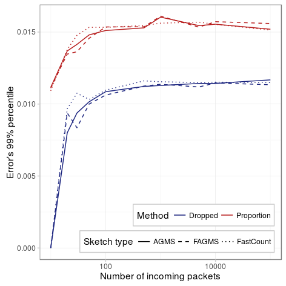
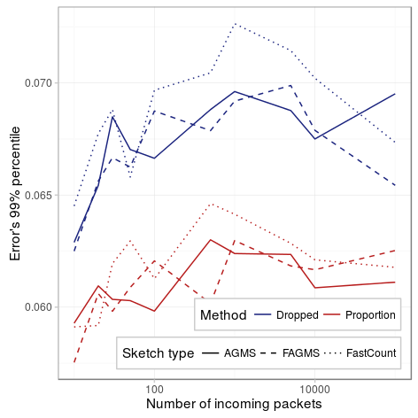

Next we will study how the number of incoming packets affect the estimation of the estimation of the proportion of dropped packets. You can reproduce the results by running the following command:


# Point to your pcap
pcap=../pcaps/equinix-chicago.dirB.20130529-135900.UTC.anon.pcap 
for ID in {1..100}
do
python estimate-ratio.py packets.$ID $pcap --rows ROWS --columns COLUMNS \
  --maxIter 100 --averageFunction mean --hashFunction default \
  --xiFunction default --dropProbability PDROP --digestSize 32
done


### Small ratio of dropped packets

Our first figure shows the 99% percentile of the error for intervals of different lengths. As we can see, the percentile soon becomes steady.

|          Parameter |                  Value                  |
|-------------------:|:---------------------------------------:|
|          _Packets_ | {10,20,30,50,100,500,1000,5000,1e4,1e5} |
| _Drop probability_ |                   10%                   |
|          _Columns_ |                    32                   |
|             _Rows_ |                    32                   |
|      _Digest size_ |                    32                   |
|    _Hash function_ |                 default                 |
|      _Xi function_ |                 default                 |
|             _Pcap_ |                  CAIDA                  |
| _Average function_ |                   mean                  |

### Large ratio of dropped packets

For a larger amount of dropped packets, we see that the 99% seems constant regardless of the number of packets. Comparing with the figure above, we can see that now, estimating both the incoming and dropped packets provides a more accurate estimation, as we saw in the previous [page](drop.html).

|          Parameter |                  Value                  |
|-------------------:|:---------------------------------------:|
|          _Packets_ | {10,20,30,50,100,500,1000,5000,1e4,1e5} |
| _Drop probability_ |                   60%                   |
|          _Columns_ |                    32                   |
|             _Rows_ |                    32                   |
|      _Digest size_ |                    32                   |
|    _Hash function_ |                 default                 |
|      _Xi function_ |                 default                 |
|             _Pcap_ |                  CAIDA                  |
| _Average function_ |                   mean                  |

### Conclusions

The results of this experiments seem to be inline with the fact that the standard error of predicting the total number of packets is proportional to the value being estimated; since now we are estimating a proportion, the error should be constant, as the linear term is canceled out.
