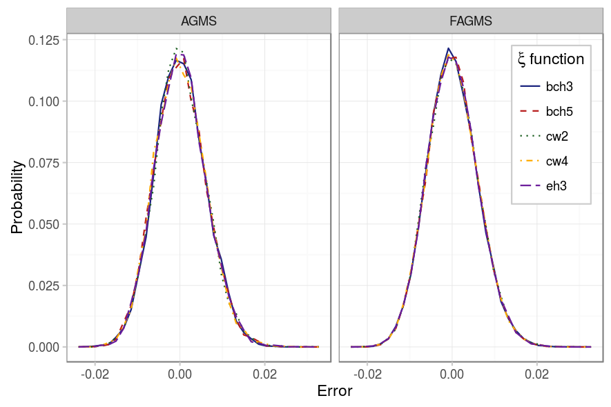
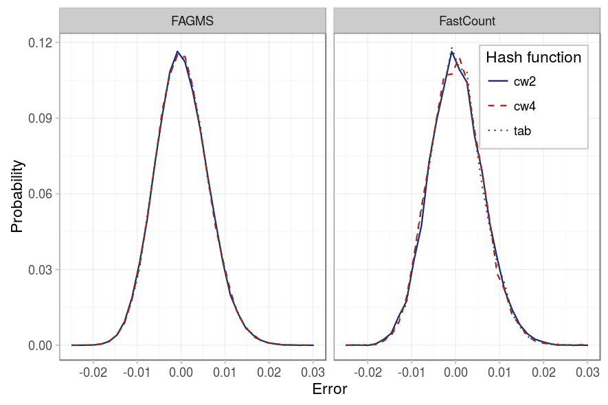

Our next experiment is just to make sure that the [results obtained previously](../estimating-total/random.html) are still valid for the case of estimating a proportion.


# Point to your pcap
pcap=../pcaps/equinix-chicago.dirB.20130529-135900.UTC.anon.pcap 
for ID in {1..100}
do
python estimate-ratio.py random.$ID $pcap --rows ROWS --columns COLUMNS \
  --numPackets PACKETS --maxIter 100 --averageFunction mean \
  --dropProbability PDROP --digestSize 32
done


As the figures below show, results are similar as previously: all the implementations for the xi and hash functions seem to provide the same standard error.

|          Parameter |            Value            |
|-------------------:|:---------------------------:|
|          _Packets_ |            10000            |
| _Drop probability_ |             10%             |
|          _Columns_ |              32             |
|             _Rows_ |              32             |
|      _Digest size_ |              32             |
|    _Hash function_ | {EH3, BCH3, BCH5, CW2, CW4} |
|      _Xi function_ |    {CW2, CW4, Tabulated}    |
|             _Pcap_ |            CAIDA            |
| _Average function_ |             mean            |

