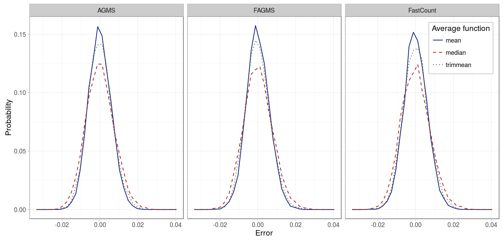
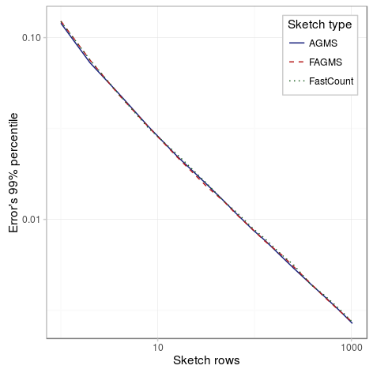
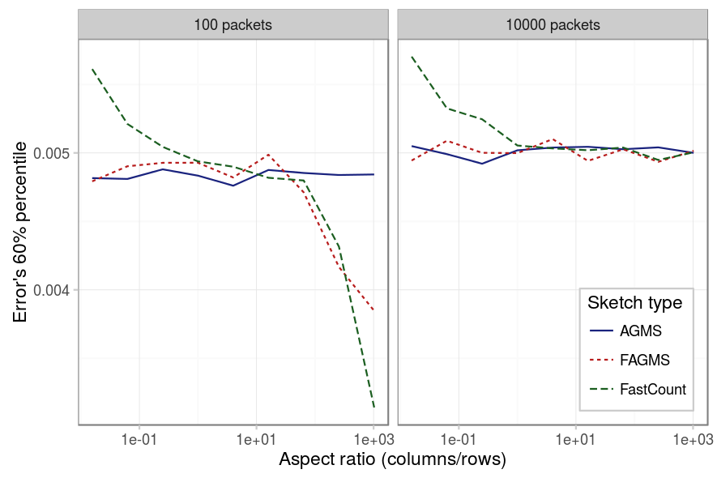

As for the case of estimating the total number of packets, we will consider the same three different factors to make sure the results are consistent on the case of estimating the proportion of dropped packets.

### Average function

In the case of estimating the total number of packets, we can see that all the estimators are fairly centered at 0. The advantage in this case of using the mean is its smaller deviation.

|          Parameter |           Value          |
|-------------------:|:------------------------:|
|          _Packets_ |           1000           |
| _Drop probability_ |            10%           |
|          _Columns_ |            32            |
|             _Rows_ |            32            |
|      _Digest size_ |            32            |
|    _Hash function_ |          default         |
|      _Xi function_ |          default         |
|             _Pcap_ |           CAIDA          |
| _Average function_ | {mean, median, trimmean} |

### Number of rows

On the other hand, the effect of the number of rows is the same: the standard error reduces approximately with the inverse of the square of the number of rows.

|          Parameter |                         Value                         |
|-------------------:|:-----------------------------------------------------:|
|          _Packets_ |                          1000                         |
| _Drop probability_ |                          10%                          |
|          _Columns_ |                           32                          |
|             _Rows_ | {1,2,4,8,16,32,48,64,96,128,192,256,384,512,768,1024} |
|      _Digest size_ |                           32                          |
|    _Hash function_ |                        default                        |
|      _Xi function_ |                        default                        |
|             _Pcap_ |                         CAIDA                         |
| _Average function_ |                          mean                         |

### Aspect ratio

The same happens with the aspect ratio: the FastCount is the sketch most affected by the aspect ratio and a square sketch tends to give good results on any case.

|          Parameter |             Value             |
|-------------------:|:-----------------------------:|
|          _Packets_ |           {100, 10000}  .     |
| _Drop probability_ |              10%              |
|          _Columns_ | {8,16,32,64,128,256,512,1024} |
|             _Rows_ |          1024/columns         |
|      _Digest size_ |               32              |
|    _Hash function_ |            default            |
|      _Xi function_ |            default            |
|             _Pcap_ |         CAIDA-no dups         |
| _Average function_ |              mean             |

