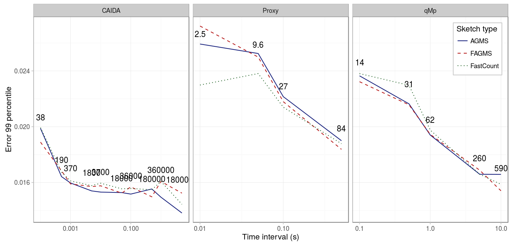

Finally, because in many situations the monitors will not be able to coordinate based on the number of packets, we study the effect of choosing different durations for the monitoring period. The figure below shows the 99 percentile for three different pcaps and different interval durations. 

|          Parameter |      Value      |
|-------------------:|:---------------:|
| _Drop probability_ |       10%       |
|          _Columns_ |        32       |
|             _Rows_ |        32       |
|      _Digest size_ |        32       |
|    _Hash function_ |     default     |
|      _Xi function_ |     default     |
|             _Pcap_ |      CAIDA      |
| _Average function_ |       mean      |

