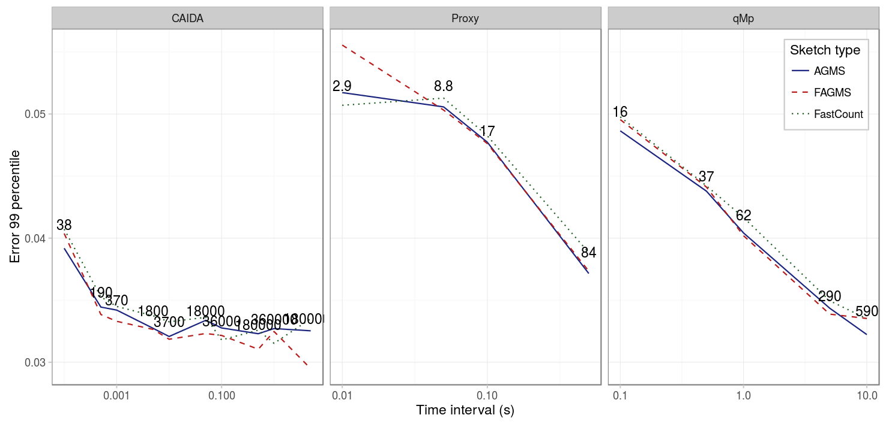
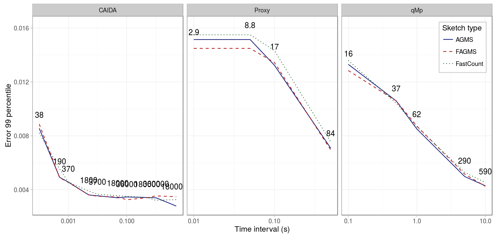

Finally, because in many situations the monitors will not be able to coordinate based on the number of packets, we study the effect of choosing different durations for the monitoring period. The figure below shows the 99 percentile for three different pcaps and different interval durations, for a network area with drop probability 0.1 and sketches of 32 by 32. As we can see, longer intervals lead to smaller error. This is due to the fact, that because the drop probability is not deterministic, if there are not enough packets, the drop probability will not be exactly 10%, but in some cases 20% in others 0%. In such cases, because higher drop probability implies higher error, the error for smaller intervals is higher.

|          Parameter |      Value      |
|-------------------:|:---------------:|
| _Drop probability_ |       10%       |
|          _Columns_ |        32       |
|             _Rows_ |        32       |
|      _Digest size_ |        32       |
|    _Hash function_ |     default     |
|      _Xi function_ |     default     |
|             _Pcap_ |      CAIDA      |
| _Average function_ |       mean      |

If we compare the results with a sketch of size 16 by 16, we can see that the results are strikingly similar, the only difference is the error scale: now the error is approximately twice the error than before.

|          Parameter |      Value      |
|-------------------:|:---------------:|
| _Drop probability_ |       10%       |
|          _Columns_ |        16       |
|             _Rows_ |        16       |
|      _Digest size_ |        32       |
|    _Hash function_ |     default     |
|      _Xi function_ |     default     |
|             _Pcap_ |      CAIDA      |
| _Average function_ |       mean      |

Finally, we compare the results when the drop probability is 0.01. As we can see in the figure below, it takes now slightly longer to estabilize, but the tendencies are the same.

|          Parameter |      Value      |
|-------------------:|:---------------:|
| _Drop probability_ |        1%       |
|          _Columns_ |        16       |
|             _Rows_ |        16       |
|      _Digest size_ |        32       |
|    _Hash function_ |     default     |
|      _Xi function_ |     default     |
|             _Pcap_ |      CAIDA      |
| _Average function_ |       mean      |

## Conclusions

Using small time intervals may lead to higher error, because the drop probability cannot be properly estimated when the number of packets is small. The standard error can be reduced, therefore by either using longer intervals, or averaging the results from several periods.

