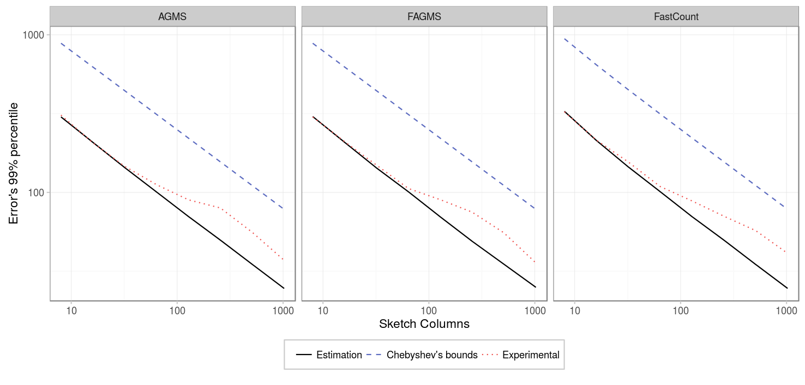

On this page we will study the effect of the columns on the accuracy of a sketch estimation. To obtain the data to reproduce the results presented run:


# Point to your pcap
pcap=../pcaps/equinix-chicago.dirB.20130529-135900.UTC.anon.pcap 
for ID in {1..200}
do
  python estimate-total.py packets.$ID $pcap --rows ROWS --numPackets PACKETS \
    --digestSize DIGESTSIZE  --maxIter 100 --averageFunction mean \
    --xiFunction default --hashFunction default
done
# Run theoretical estimations
./SketchesPMF ../results/PMF --sketchType AGMS --sketchType FAGMS \
  --sketchType FastCount --packets PACKETS --columns COLUMNS --rows ROWS
# Alternatively, if the number of packets is high: 
./SketchesPMF ../results/PMF --sketchType AGMS --sketchType FAGMS \
  --sketchType FastCount --packets PACKETS --columns COLUMNS --rows ROWS \
  --montecarlo


### Few packets
First, we will consider that only a small number of packets are being sketched. The figures below show different percentiles of the error, e.g. for the 99% percentile, 99% of the time the estimations given by the sketch will have an absolute error that is below the given value.

|          Parameter |             Value             |
|-------------------:|:-----------------------------:|
|          _Packets_ |              100              |
|          _Columns_ | {8,16,32,64,128,256,512,1024} |
|             _Rows_ |               1               |
|      _Digest size_ |               32              |
|    _Hash function_ |            default            |
|      _Xi function_ |            default            |
|             _Pcap_ |             CAIDA             |

As expected, the standard error decreases as the number of columns increases; specifically, the standard error is inversely proportional to the square root of the number of columns. Showing all the sketch types in the same figure, we can see that there is not much difference between the different types of sketches.

### More packets

Our second experiment considers 10000 packets instead, and the results are the same as for the previous case.

|          Parameter |             Value             |
|-------------------:|:-----------------------------:|
|          _Packets_ |             10000             |
|          _Columns_ | {8,16,32,64,128,256,512,1024} |
|             _Rows_ |               1               |
|      _Digest size_ |               32              |
|    _Hash function_ |            default            |
|      _Xi function_ |            default            |
|             _Pcap_ |             CAIDA             |

### Several rows

But when we run the experiment with 32 rows instead, we found a surprising result:

|          Parameter |             Value             |
|-------------------:|:-----------------------------:|
|          _Packets_ |             1000.             |
|          _Columns_ | {8,16,32,64,128,256,512,1024} |
|             _Rows_ |               32              |
|      _Digest size_ |               32              |
|    _Hash function_ |            default            |
|      _Xi function_ |            default            |
|             _Pcap_ |             CAIDA             |
| _Average function_.|            median             |

We saw that there was a higher error than expected. After investigating a little bit, we discovered that there were some repeated packets on the pcap at some interval, (11 of them), causing it to over estimate the prediction by around 120 (11^2=121) in one of the 100 intervals:

Indeed, when we replicated the experiment with the same pcap, but removing the repeated packets, we saw that the standard error decreased as the number of columns increased, proportionally to 1/sqrt(columns).

|          Parameter |             Value             |
|-------------------:|:-----------------------------:|
|          _Packets_ |             1000.             |
|          _Columns_ | {8,16,32,64,128,256,512,1024} |
|             _Rows_ |               32              |
|      _Digest size_ |               32              |
|    _Hash function_ |            default            |
|      _Xi function_ |            default            |
|             _Pcap_ |         CAIDA-no dups         |
| _Average function_.|            median             |

### Conclusion

The standard error of the estimation decreases as the number of columns increases, and the results are really similar for all the sketch types. During these experiments, we saw how important is the assumption of not having duplicates, otherwise the error can be much higher than expected.
