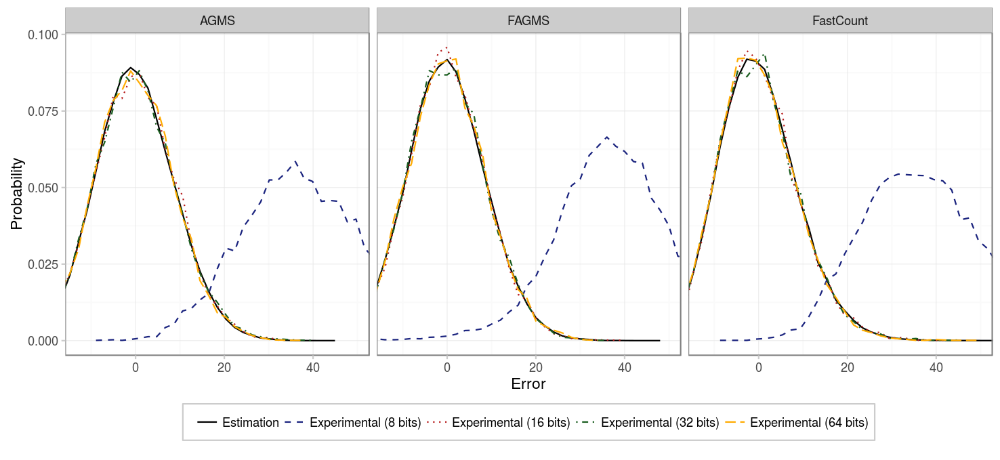
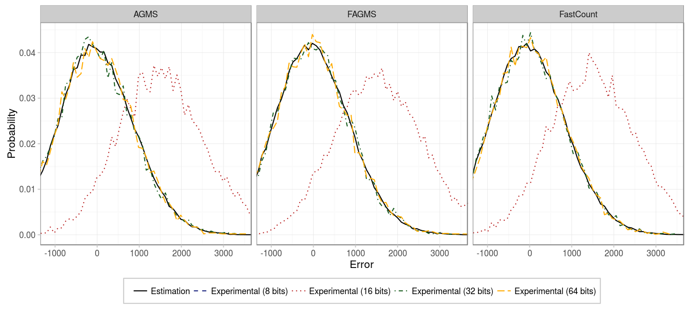
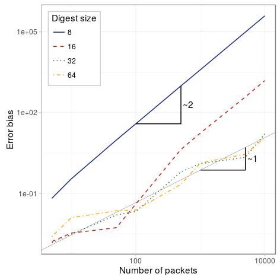

On these experiments, we will study the effect of choosing digests of different sizes. To reproduce the experiments run the following commands replacing the given variables.


# Point to your pcap
pcap=../pcaps/equinix-chicago.dirB.20130529-135900.UTC.anon.pcap 
for ID in {1..100}
do
  python basic_estimation.py digest1.$ID $pcap --rows ROWS --columns COLUMNS \
    --hashFunction default --xiFunction default --numPackets PACKETS \
    --maxIter 100 --averageFunction default
done
# Run theoretical estimations
./SketchesPMF results/PMF --sketchType AGMS --sketchType FAGMS \
  --sketchType FastCount --packets PACKETS --columns COLUMNS --rows ROWS
# Alternatively, if the number of packets is high: 
./SketchesPMF results/PMF --sketchType AGMS --sketchType FAGMS \
  --sketchType FastCount --packets PACKETS --columns COLUMNS --rows ROWS \
  --montecarlo


### Just a few packets

Our first experiment considers basic sketches (just 1 row) of 256 counters and not so many packets (100). As we can see in the figure below, whenever using 16, 32 or 64 bits, the results are consistent and the error is centered in 0. However, using 8 bits produces a biased estimation, because many packets share the same digest. If you remember from before, sketches actually estimate the second frequency moment (e.g. the square of the number of elements of each type), in our case, because our elements are unique, the second and first frequency moment are the same (i.e. squaring 1 is 1). However, when some packets collide and produce the same digest, the estimation will square its value, providing an overestimation of the actual value.

|       Parameter |      Value      |
|----------------:|:---------------:|
|       _Packets_ |       100       |
|       _Columns_ |       256       |
|          _Rows_ |        1        |
|   _Digest size_ | {8, 16, 32, 64} |
| _Hash function_ |       CW4       |
|   _Xi function_ |       EH3       |
|          _Pcap_ |      CAIDA      |  

### More packets

So what happens if we have a sketch with many more packets? That is what our next experiment tried to see next, when we considered 10000 packets.

|       Parameter |      Value      |
|----------------:|:---------------:|
|       _Packets_ |      10000      |
|       _Columns_ |       256       |
|          _Rows_ |        1        |
|   _Digest size_ | {8, 16, 32, 64} |
| _Hash function_ |       CW4       |
|   _Xi function_ |       EH3       |
|          _Pcap_ |      CAIDA      |

As the figure shows, now, not even the 16 bits digest can give us an unbiased estimation, so we need a larger digest if we do not want to overestimate the estimation.

### Bias based on the number of packets

So what is the bias of the estimation depending on the number of packets and the digest size? Check the figure below:

The figure is in log-log scale, so the slope of the lines determine the relation between the packets and the bias on the estimation. As we can see, for the studied range of packets, 8 and 6 bits tend rapidly to be proportional to N^2, while 32 and 64 bits have a bias that is proportional N, where N is the number of packets.

|       Parameter |                              Value                              |
|----------------:|:---------------------------------------------------------------:|
|       _Packets_ | {5,10,20,30,50,100,500,1e3, 2e3, 3e3, 5e3, 1e4,2e4,3e4,5e4,1e5} |
|       _Columns_ |                               256                               |
|          _Rows_ |                                1                                |
|   _Digest size_ |                         {8, 16, 32, 64}                         |
| _Hash function_ |                               CW4                               |
|   _Xi function_ |                               EH3                               |
|          _Pcap_ |                              CAIDA                              |

### Conclusion

The digest size should be chosen properly so that our estimator is not biased. However, because we are estimating the number of dropped packets, which in benign cases will be low and in case of failure we won't mind that the value is overestimated, since we are just interested in detection, this should not be a great limitation. To determine the proper digest size for your network make sure that given the maximum number of packets within a monitoring interval and the max percentage loss of a benign node/link, the bias of estimation (max\_packets * loss\_probability) is within the linear region of the previous figure.

