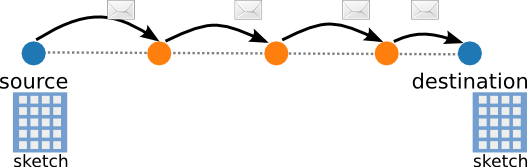
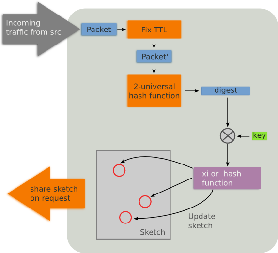

This page goes through all the factors that influence the accuracy of an sketch when predicting the total number of packets it represents.  
If you'd rather view all the results in a single page, follow this [link](all)  

Estimating the total number of packets of specially useful when we consider an scenario as the one in the figure above, where we have a source and a destination and we want to determine whether the path used for communicating is behaving properly or not. The source can keep a sketch with every packet it has sent and so will the destination with each packet received. After some time, the source will request the destination for its sketch, and because we can combine them linearly, if we substract them, we will obtain the packets that have not been received. If the number of lost packets is too big, then the source can decide to use an alternative path to forward the packets to that destination. And [fault localization can be achieved by monitoring links of different lengths](http://ieeexplore.ieee.org/xpls/abs_all.jsp?arnumber=1673382).

But we know that sketches are not 100% accurate, so its important to know how likely we are to make a mistake on classifing a path, network or node as faulty. And the accuracy will be determined by the several implementation decissions taken along the way.

## So... How is monitoring implemented when we use sketches?

  

The figure above shows the steps that the monitor at the destination follows every time a packet from the source arrives. Similarly, the source would do the same for the packets sent to the destination. In general, when a monitor receives or sends a packet to a node belonging to the monitored network area, it follows the next steps:  

1. First, the packet being sketched must be the same at any point that will be seen by the monitors. That implies that we need to delete or fix every field that changes from hop to hop. Typically, we will strip any header below the IP layer and fix the TTL field. In the general case, we will set the TTL field to 0, except we are directly monitoring a single node, that allow us to simply decrease by 2 the TTL field when is a packet being sent, and do nothing when is a packet received.
2. Then, because sketches implementations rely mainly in +-1 4-wise pseudo-random functions and/or hash functions and those functions work faster when the input space is reduced, the packet is reduced to a digest of fixed size using a hash function.
3. Optionally, the digest may be xor'ed with a secret key.
4. Finally, the sketch can be updated as required using the implemented random functions. 

## Experiments

Our next step is to implement an experiment that simulates the process described before, and see how the predicted value deviates from the real number of packets for different values for each variable. We have done so by reading a set of pcaps, and updating sketches of different characteristics with their packets. The variables that we have studied and the results obtained are described in the following pages:

* [Digest size](digest.html)
* [Pseudo-random function](random.html)
* [Number of packets](packets.html)
* [Number of columns](columns.html)
* [Number of rows](rows.html)

For the experiments described above, we have used three different pcap files: one from the [CAIDA data set](http://www.caida.org/data/), another from a mesh router from [qMp Sants](http://dsg.ac.upc.edu/qmpsu) and another from a proxy of [Guifi.net](http://www.guifi.net). We can see their main characteristics in the table below:

|                                |      CAIDA      |   qMp Sants  |     Proxy     |
|-------------------------------:|:---------------:|:------------:|:-------------:|
|                     _Duration_ |     10.59 s     |     842 s    |    58.99 s    |
|                  _Packet rate_ | ~350 Kpackets/s | 59 packets/s | 168 packets/s |
|                      _Bitrate_ |     220 Mbps    |  0.366 Mbps  |   1.52 Mbps   |
|            _Mean arrival time_ |    0.0028 ms    |   16.84 ms   |    5.95 ms    |
|_Deviation of the arrival time_ |    0.0029 ms    |   97.73 ms   |    11.3 ms    |

As we can see there is a big difference between the first pcap, which belongs to a heavily used wired network, with quite stable network load; compared with the other two that belong to a Wireless Community Network, with lower and much more variable network load.  

On the experiments, because the pcap files contain only the first bytes of each packets, the missing bytes were generated randomly.

More details about the scripts and code used can be found [here](/scripts).
