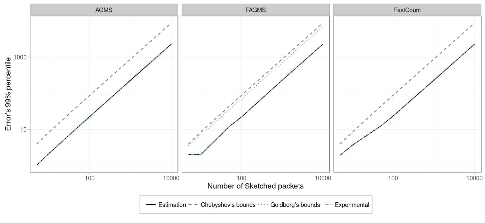
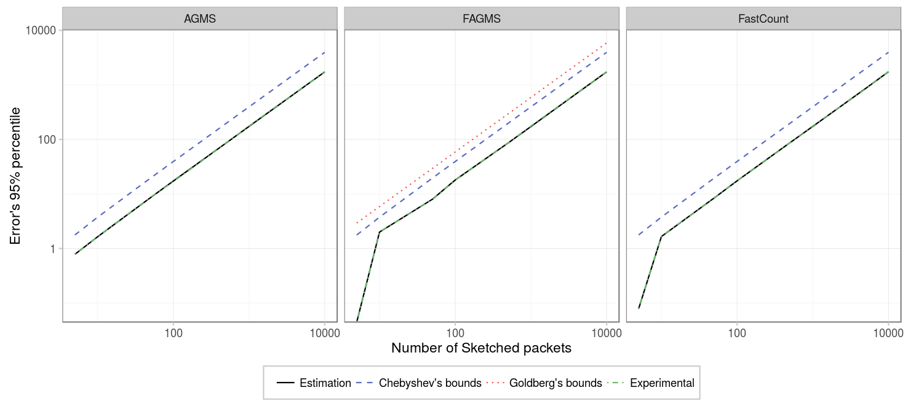
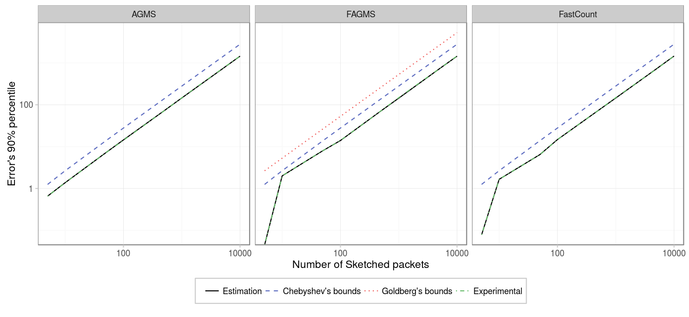
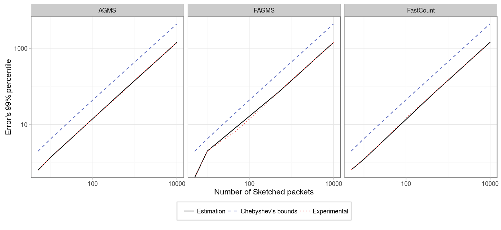
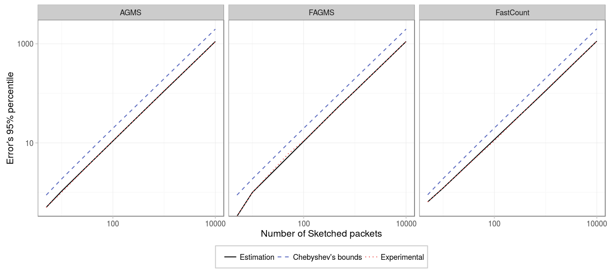
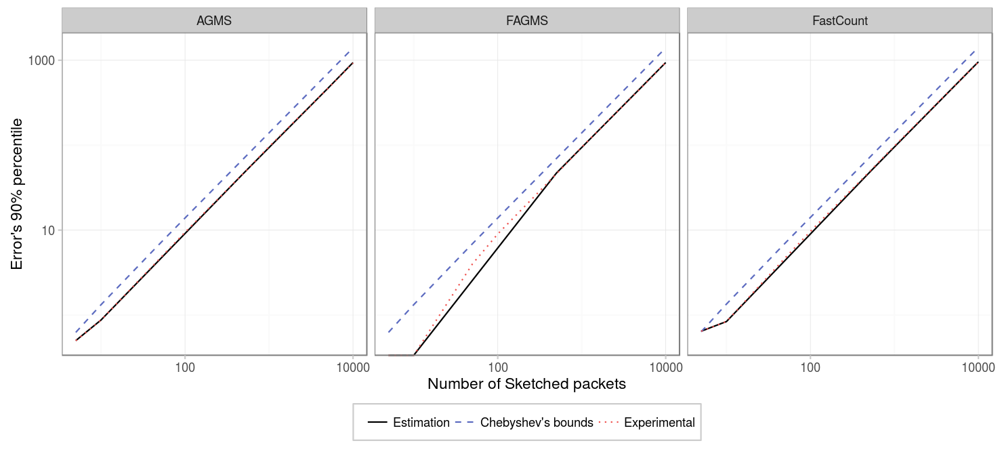

Our next step is to study the effect of the value being predicted, the number of different packets, on the accuracy of the estimation. To run the experiments with different number of packets, just execute the following commands:


# Point to your pcap
pcap=../pcaps/equinix-chicago.dirB.20130529-135900.UTC.anon.pcap 
for ID in {1..100}
do
  python estimate-total.py packets.$ID $pcap --rows ROWS --columns COLUMNS \
    --digestSize DIGESTSIZE  --maxIter 100 --averageFunction mean \
    --xiFunction default --hashFunction default
done
# Run theoretical estimations
./SketchesPMF ../results/PMF --sketchType AGMS --sketchType FAGMS \
  --sketchType FastCount --packets PACKETS --columns COLUMNS --rows ROWS
# Alternatively, if the number of packets is high: 
./SketchesPMF ../results/PMF --sketchType AGMS --sketchType FAGMS \
  --sketchType FastCount --packets PACKETS --columns COLUMNS --rows ROWS \
  --montecarlo


### Basic estimator

First we are going to consider a sketch with a single row, and 256 columns. As we can see, except for smaller values of the number of sketched packets, the tendency for any percentile is to grow proportionally to the number of packets and the proposed estimation provides a really accurate prediction of the percentile.

|       Parameter |               Value               |
|----------------:|:---------------------------------:|
|       _Packets_ | {5,10,50,100,500,1000,5000,10000} |
|       _Columns_ |                256                |
|          _Rows_ |                 1                 |
|   _Digest size_ |                 32                |
| _Hash function_ |              default              |
|   _Xi function_ |              default              |
|          _Pcap_ |               CAIDA               |

Showing all the sketch types in the same figure to appreciate better the difference between them we can see that 

### Square sketch

For the case of a sketch with 32 columns by 32 rows the results are pretty similar.

|          Parameter |               Value               |
|-------------------:|:---------------------------------:|
|          _Packets_ | {5,10,50,100,500,1000,5000,10000} |
|          _Columns_ |                 32                |
|             _Rows_ |                 32                |
|      _Digest size_ |                 32                |
|    _Hash function_ |              default              |
|      _Xi function_ |              default              |
|             _Pcap_ |               CAIDA               |
| _Average function_ |                mean               |

### Conclusion

As expected, the estimation of the sketch is less accurate as the number of sketched packets increases, however, because its standard error is proportional to the number of sketched packets, the relative standard error is constant. And all sketches have a pretty similar accuracy.
