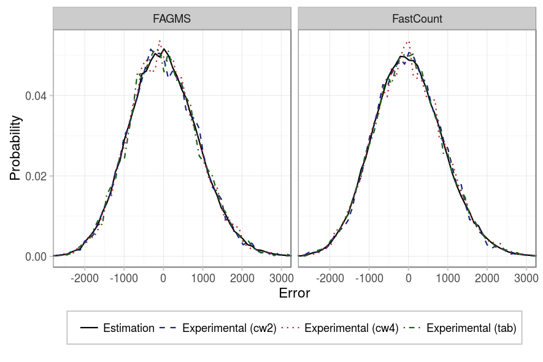
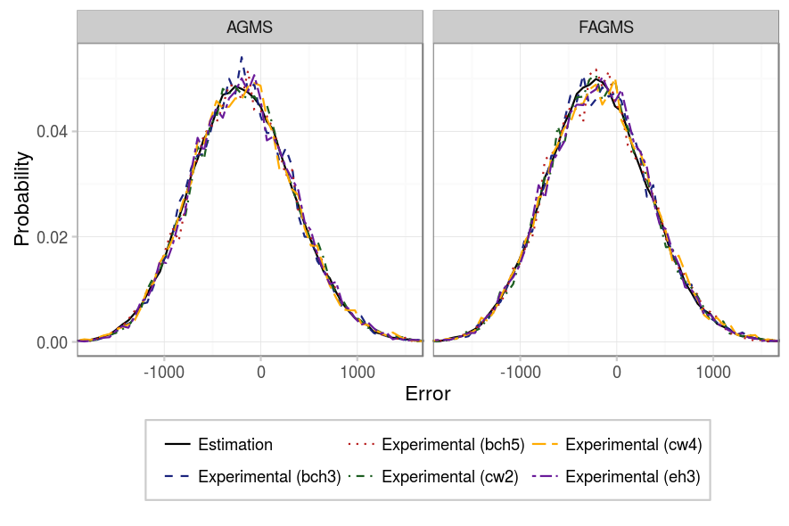
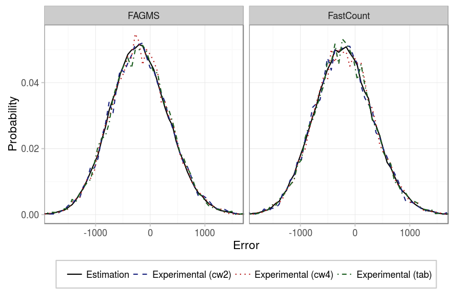

The goal of the following experiments is to study the effect of the different implementations for the +-1 functions and hash functions that sketches require. To reproduce the experiments just run the following command with the appropriate parameters:


# Point to your pcap
pcap=../pcaps/equinix-chicago.dirB.20130529-135900.UTC.anon.pcap 
for ID in {1..100}
do
  python basic_estimation.py random.$ID $pcap --rows ROWS --columns COLUMNS \
    --digestSize DIGESTSIZE --numPackets PACKETS --maxIter 100 \
    --averageFunction default
done
# Run theoretical estimations
./SketchesPMF results/PMF --sketchType AGMS --sketchType FAGMS \
  --sketchType FastCount --packets PACKETS --columns COLUMNS --rows ROWS
# Alternatively, if the number of packets is high: 
./SketchesPMF results/PMF --sketchType AGMS --sketchType FAGMS \
  --sketchType FastCount --packets PACKETS --columns COLUMNS --rows ROWS \
  --montecarlo


### Just a few packets

As for the digest size, our first experiment considers basic sketches (just 1 row) of 256 counters and not so many packets (100). The figures below show the effect of the +-1 function (xi) and hash function depending on the sketch type. On a first glance, it seems that any pseudo-random function performs its job as expected. 

|       Parameter |            Value            |
|----------------:|:---------------------------:|
|       _Packets_ |             100             |
|       _Columns_ |             256             |
|          _Rows_ |              1              |
|   _Digest size_ |              32             |
| _Hash function_ |    {CW2, CW4, Tabulated}    |
|   _Xi function_ | {EH3, BCH3, BCH5, CW2, CW4} |
|          _Pcap_ |            CAIDA            |

### More packets

But will the pseudo-random functions still perform ok when we sketch more packets? In our next experiment we considered 10000 packets, and as the figures shows, still, every implementation works as expected.

|       Parameter |            Value            |
|----------------:|:---------------------------:|
|       _Packets_ |            10000            |
|       _Columns_ |             256             |
|          _Rows_ |              1              |
|   _Digest size_ |              32             |
| _Hash function_ |    {CW2, CW4, Tabulated}    |
|   _Xi function_ | {EH3, BCH3, BCH5, CW2, CW4} |
|          _Pcap_ |            CAIDA            |

### Several rows

However, if we use a sketch with several rows, as in the following experiment, now, the hash function for the FastCount sketch is relevant, as we can see in the figures below. If we use CW2 instead of CW4, the error between the different rows will be correlated, and our prediction will not be as good as expected.

|          Parameter |            Value            |
|-------------------:|:---------------------------:|
|          _Packets_ |            10000            |
|          _Columns_ |              16             |
|             _Rows_ |              16             |
| _Average function_ |             mean            |
|      _Digest size_ |              32             |
|    _Hash function_ |    {CW2, CW4, Tabulated}    |
|      _Xi function_ | {EH3, BCH3, BCH5, CW2, CW4} |
|             _Pcap_ |            CAIDA            |

### Conclusion

Regarding the implementation of the different Xi functions, every one of them seems to provide the same accuracy, so the decision between one or another can be taken based on the CPU or memory requirements of each implementation. On the other hand, regarding the different hash functions, in the case of the FastCount sketch, we have seen that if it has more than one row, we require a 4-wise independent hash function, i.e. either CW4 or Tabulated hashing.
