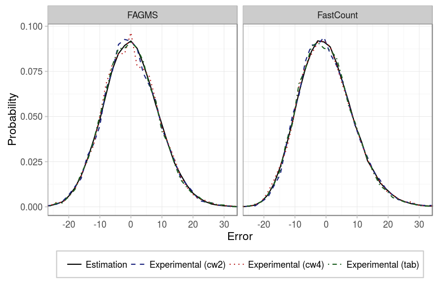
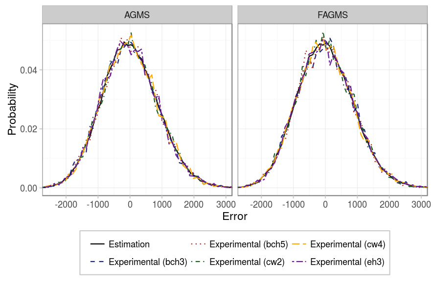

The goal of the following experiments is to study the effect of the different implementations for the +-1 functions and hash functions that sketches require. To reproduce the experiments just run the following command with the appropriate parameters:


# Point to your pcap
pcap=../pcaps/equinix-chicago.dirB.20130529-135900.UTC.anon.pcap 
for ID in {1..100}
do
  python estimate-total.py random.$ID $pcap --rows ROWS --columns COLUMNS \
    --digestSize DIGESTSIZE --numPackets PACKETS --maxIter 100 \
    --averageFunction default
done
# Run theoretical estimations
./SketchesPMF results/PMF --sketchType AGMS --sketchType FAGMS \
  --sketchType FastCount --packets PACKETS --columns COLUMNS --rows ROWS
# Alternatively, if the number of packets is high: 
./SketchesPMF results/PMF --sketchType AGMS --sketchType FAGMS \
  --sketchType FastCount --packets PACKETS --columns COLUMNS --rows ROWS \
  --montecarlo


### Just a few packets

As for the digest size, our first experiment considers basic sketches (just 1 row) of 256 counters and not so many packets (100). The figures below show the effect of the +-1 function (xi) and hash function depending on the sketch type. On a first glance, it seems that any pseudo-random function performs its job as expected. 

|       Parameter |            Value            |
|----------------:|:---------------------------:|
|       _Packets_ |             100             |
|       _Columns_ |             256             |
|          _Rows_ |              1              |
|   _Digest size_ |              32             |
| _Hash function_ |    {CW2, CW4, Tabulated}    |
|   _Xi function_ | {EH3, BCH3, BCH5, CW2, CW4} |
|          _Pcap_ |            CAIDA            |

### More packets

But will the pseudo-random functions still perform ok when we sketch more packets? In our next experiment we considered 10000 packets, and as the figures shows, still, every implementation works as expected.

|       Parameter |            Value            |
|----------------:|:---------------------------:|
|       _Packets_ |            10000            |
|       _Columns_ |             256             |
|          _Rows_ |              1              |
|   _Digest size_ |              32             |
| _Hash function_ |    {CW2, CW4, Tabulated}    |
|   _Xi function_ | {EH3, BCH3, BCH5, CW2, CW4} |
|          _Pcap_ |            CAIDA            |

### Several rows

Our last experiment, made sure that even in the case of several rows, every implementation provides the same guarantees.

|          Parameter |            Value            |
|-------------------:|:---------------------------:|
|          _Packets_ |            10000            |
|          _Columns_ |              16             |
|             _Rows_ |              16             |
| _Average function_ |             mean            |
|      _Digest size_ |              32             |
|    _Hash function_ |    {CW2, CW4, Tabulated}    |
|      _Xi function_ | {EH3, BCH3, BCH5, CW2, CW4} |
|             _Pcap_ |            CAIDA            |

### Conclusion

In every experiment we have done, there was no significant difference between the different implementations for both the Xi and hash functions. This implies that for the case of traffic validation, 4-wise independence is not needed, and weaker functions (such as eh3, bch3 and cw2) can be used instead. These weaker functions have the benefit of being faster and requiring less memory.
