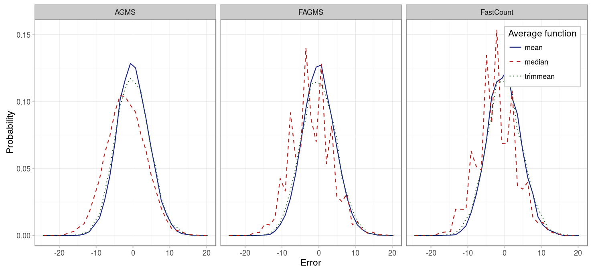
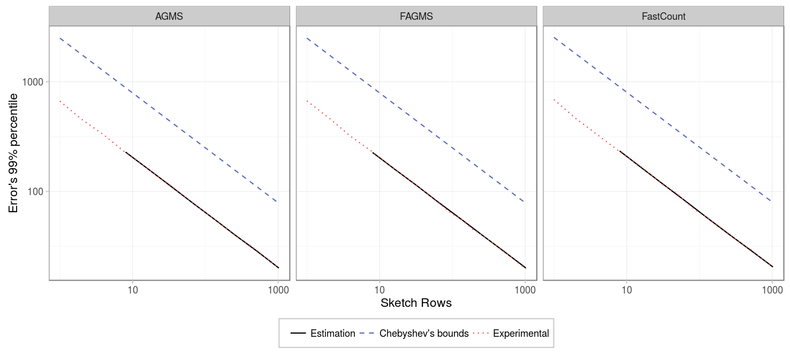
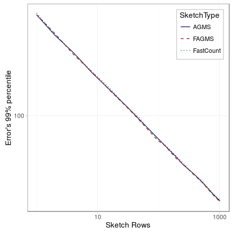
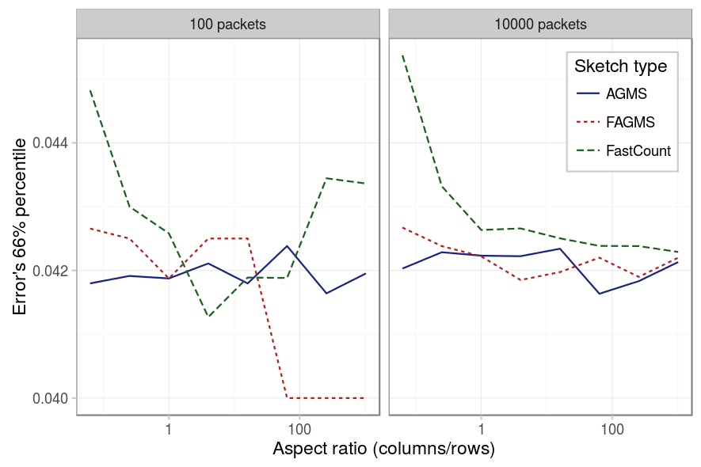
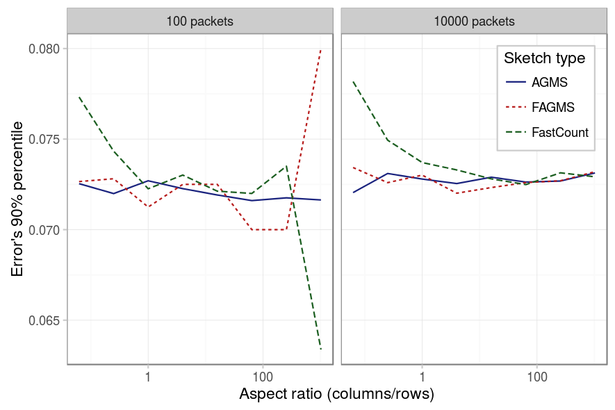
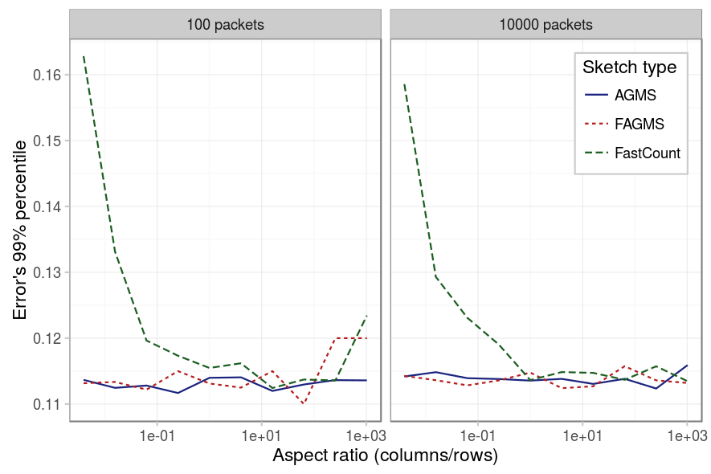
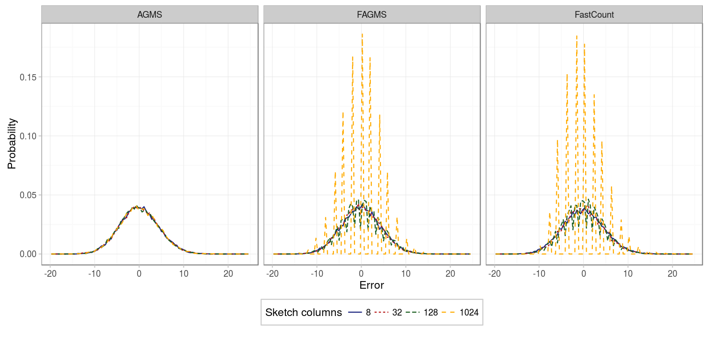
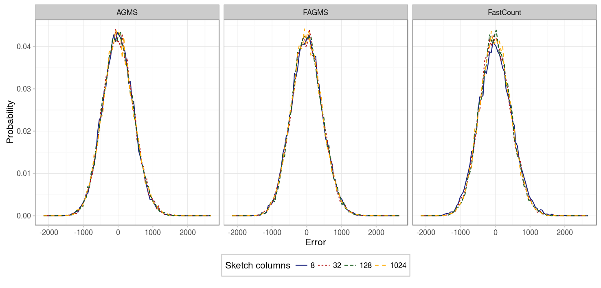
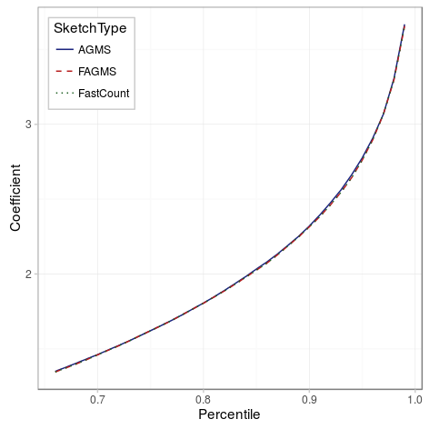

The final variable that we are gonna consider is the number of rows of the sketch. However, in this case, there are several decissions that must be taken if we decide to increase the number of rows of a sketch:

* First, the estimation given by each row needs to be combined into an averaged estimation. The AGMS and Fast-AGMS propose to average them using the median, whereas the FastCount sketch proposes to use the median. Our first goal will be to check which average function is better for each type of sketch.
* Second, we study the effect itself of increasing the number of rows and how they affect the standard error of the estimation.
* But, increasing the number of rows implies that the memory and network bandwidth required also grow. When limited by them, we have to prioritize between increasing the number of columns or the number of rows. Therefore, we will study the effect of the sketch aspect ratio on its accuracy to answer the question of whether is better to increase the number of rows or columns.

### Average function

To see which average function provides the best results, let's see the distribution of the error for each of them:

|          Parameter |           Value          |
|-------------------:|:------------------------:|
|          _Packets_ |            100           |
|          _Columns_ |            32            |
|             _Rows_ |            32            |
|      _Digest size_ |            32            |
|    _Hash function_ |          default         |
|      _Xi function_ |          default         |
|             _Pcap_ |      CAIDA-no dups       |
| _Average function_ | {mean, median, trimmean} |

The spiky behavior of the median is due to the fact that less values are possible for the median. In general, we see that the median seems not to be centered at 0 and that its deviation is higher. In fact, if we measure the mean error and standard deviation for each sketch type and average function we obtain:

|            |   __AGMS__   | __Fast-AGMS__ | __FastCount__ |
|-----------:|:------------:|:-------------:|:-------------:|
|   _median_ | -1.93 (5.32) |  -2.01 (5.38) |  -2.19 (5.35) |
|     _mean_ | -0.01 (4.36) |  0.00 (4.44)  |  -0.10 (4.47) |
| _trimmean_ | -0.08 (4.64) |  -0.02 (4.74) |  -0.04 (4.80) |

Similar results are obtained if we sketch more packets, just that now the bias and standard deviation are higher.

|          Parameter |           Value          |
|-------------------:|:------------------------:|
|          _Packets_ |           10000          |
|          _Columns_ |            32            |
|             _Rows_ |            32            |
|      _Digest size_ |            32            |
|    _Hash function_ |          default         |
|      _Xi function_ |          default         |
|             _Pcap_ |      CAIDA-no dups       |
| _Average function_ | {mean, median, trimmean} |

|            |   __AGMS__   | __Fast-AGMS__ | __FastCount__ |
|-----------:|:------------:|:-------------:|:-------------:|
|   _median_ |  -192 (534)  |   -202 (535)  |   -203 (546)  |
|     _mean_ |  1.99 (444)  |   4.26 (449)  |   0.29 (448)  |
| _trimmean_ | -7.18 (469)  |   6.97 (470)  |   6.62 (481)  |

In summary, using the mean provides better results than using the median for every sketch type, and since computing the mean is easier than the median, it should be prefered in any case.

### Number of rows

Next, we study how the number of rows affects in the error deviation. As we can see, more rows imply an smaller error. Approximately the standard error is proportional to 1/sqrt(rows).

|          Parameter |                         Value                         |
|-------------------:|:-----------------------------------------------------:|
|          _Packets_ |                          1000                         |
|          _Columns_ |                           32                          |
|             _Rows_ | {1,2,4,8,16,32,48,64,96,128,192,256,384,512,768,1024} |
|      _Digest size_ |                           32                          |
|    _Hash function_ |                        default                        |
|      _Xi function_ |                        default                        |
|             _Pcap_ |                     CAIDA-no dups                     |
| _Average function_ |                          mean                         |

### Aspect ratio

Finally, we study if there is a proportion of rows-packets that provides better results. The first three figures below show each for a different percentile, its error for different aspect ratios. We can observe on the different figures the following:

* For the AGMS sketch, as expected, there is no difference between rows and columns.
* For the Fast-AGMS sketch, when there are little packets, a high number of columns implies that the results are not stable, this can be better understoond by checking the fourth figure, which shows the PMF of for some aspect ratios: when the number of columns is high, the results are more grouped around certain values, causing the difference between different percentiles to be really sensible to where such percentile falls (is it just to the right or the left of one of the error values?).
* For the FastCount sketch we can see the same for the case of low packets and high number of columns. But additinally, we see that if the number of columns is low, the results tend to be worse in any case.

|          Parameter |             Value             |
|-------------------:|:-----------------------------:|
|          _Packets_ |           {100, 10000}  .     |
|          _Columns_ | {8,16,32,64,128,256,512,1024} |
|             _Rows_ |          1024/columns         |
|      _Digest size_ |               32              |
|    _Hash function_ |            default            |
|      _Xi function_ |            default            |
|             _Pcap_ |         CAIDA-no dups         |
| _Average function_ |              mean             |

The results were later analyzed using a [Pearson's Chi-square test for equality of percentiles](http://www.ncbi.nlm.nih.gov/pmc/articles/PMC4535814/) and as expected, the FastCount is affected by the aspect ratio in any case; the AGMS in no case and the Fast-AGMS only when the number of packets is low.

### Regression

To sum up, we considered the three main variables involved: the number of sketched packets, the number of columns and the number of rows and estimated the coefficients as a function of the standard deviation. We later have seen how precise those coefficients correspond with high accuracy to those of a Gaussian distribution ([code](../../scripts/estimate-total.R):

### Conclusion

We have seen that increasing the number of rows decreases the standard error and that using the mean is the best way of combining the results between different rows. Regarding the aspect ratio of the sketch, one must be careful specially for the FastCount sketch, for which we need to have at least as many columns as rows to obtain better predictions. When the number of packets being predicted is relatively high (or we have more rows), i.e. the support of the PMF will have enough points, we can [approximate the PMF of the error as a Gaussian function](http://dsg.ac.upc.edu/esterl/sketches/AGMS) with mean 0 and deviation N/sqrt(size\*2) for the AGMS and FastAGMS sketch and N/sqrt((columns-1)\*rows*2) for the FastCount sketch. As a consequence, AGMS and FastAGMS have the same precission, but FastCount requires an additional column to be as precise as the other two sketches.
