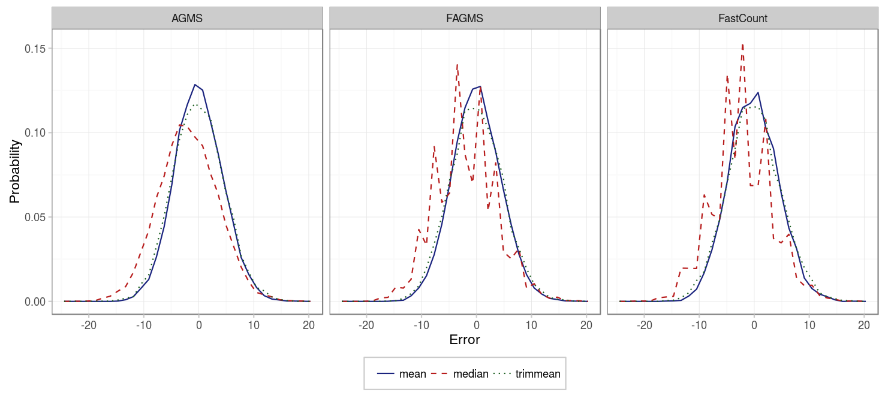
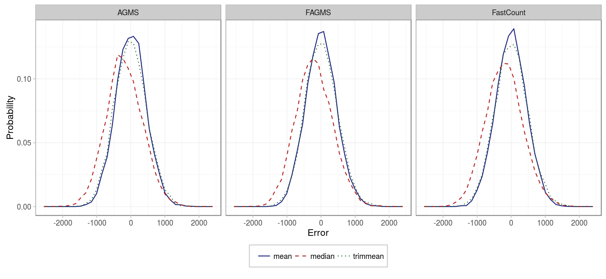
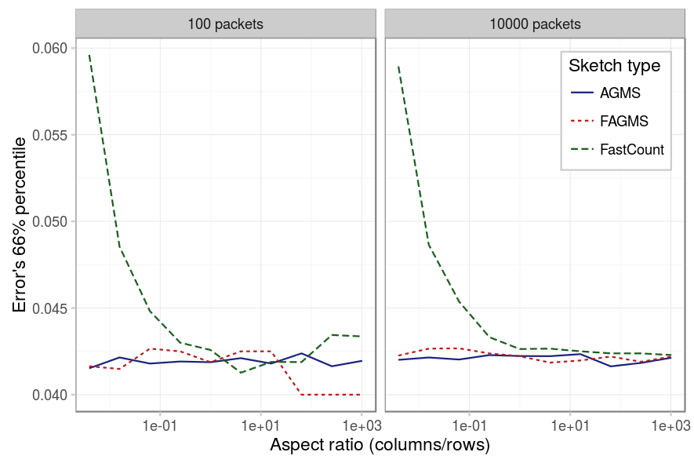

The final variable that we are gonna consider is the number of rows of the sketch. However, in this case, there are several decissions that must be taken if we decide to increase the number of rows of a sketch:

* First, the estimation given by each row needs to be combined into an averaged estimation. The AGMS and Fast-AGMS propose to average them using the median, whereas the FastCount sketch proposes to use the median. Our first goal will be to check which average function is better for each type of sketch.
* Second, we study the effect itself of increasing the number of rows and how they affect the standard error of the estimation.
* But, increasing the number of rows implies that the memory and network bandwidth required also grow. When limited by them, we have to prioritize between increasing the number of columns or the number of rows. Therefore, we will study the effect of the sketch aspect ratio on its accuracy to answer the question of whether is better to increase the number of rows or columns.

### Average function

To see which average function provides the best results, let's see the distribution of the error for each of them:

|          Parameter |           Value          |
|-------------------:|:------------------------:|
|          _Packets_ |            100           |
|          _Columns_ |            32            |
|             _Rows_ |            32            |
|      _Digest size_ |            32            |
|    _Hash function_ |          default         |
|      _Xi function_ |          default         |
|             _Pcap_ |      CAIDA-no dups       |
| _Average function_ | {mean, median, trimmean} |

The spiky behavior of the median is due to the fact that less values are possible for the median. In general, we see that the median seems not to be centered at 0 and that its deviation is higher. In fact, if we measure the mean error and standard deviation for each sketch type and average function we obtain:

|            |   __AGMS__   | __Fast-AGMS__ | __FastCount__ |
|-----------:|:------------:|:-------------:|:-------------:|
|   _median_ | -1.93 (5.32) |  -2.01 (5.38) |  -2.19 (5.35) |
|     _mean_ | -0.01 (4.36) |  0.00 (4.44)  |  -0.10 (4.47) |
| _trimmean_ | -0.08 (4.64) |  -0.02 (4.74) |  -0.04 (4.80) |

Similar results are obtained if we sketch more packets, just that now the bias and standard deviation are higher.

|          Parameter |           Value          |
|-------------------:|:------------------------:|
|          _Packets_ |           10000          |
|          _Columns_ |            32            |
|             _Rows_ |            32            |
|      _Digest size_ |            32            |
|    _Hash function_ |          default         |
|      _Xi function_ |          default         |
|             _Pcap_ |      CAIDA-no dups       |
| _Average function_ | {mean, median, trimmean} |

|            |   __AGMS__   | __Fast-AGMS__ | __FastCount__ |
|-----------:|:------------:|:-------------:|:-------------:|
|   _median_ |  -192 (534)  |   -202 (535)  |   -203 (546)  |
|     _mean_ |  1.99 (444)  |   4.26 (449)  |   0.29 (448)  |
| _trimmean_ | -7.18 (469)  |   6.97 (470)  |   6.62 (481)  |

In summary, using the mean provides better results than using the median for every sketch type, and since computing the mean is easier than the median, it should be prefered in any case.

### Number of rows

Next, we study how the number of rows affects in the error deviation. As we can see, more rows imply an smaller error. Approximately the standard error is proportional to 1/sqrt(rows).

|          Parameter |                         Value                         |
|-------------------:|:-----------------------------------------------------:|
|          _Packets_ |                          1000                         |
|          _Columns_ |                           32                          |
|             _Rows_ | {1,2,4,8,16,32,48,64,96,128,192,256,384,512,768,1024} |
|      _Digest size_ |                           32                          |
|    _Hash function_ |                        default                        |
|      _Xi function_ |                        default                        |
|             _Pcap_ |                     CAIDA-no dups                     |
| _Average function_ |                          mean                         |

### Aspect ratio

Finally, we study if there is a proportion of rows-packets that provides better results. As we can see in the figure below, for the AGMS sketch, there is no difference, because we are using the mean, and so the role of rows and columns is the same. For the Fast-AGMS, more rows provide a better result when the number of packets is low, as the effect of the +-1 pseudo-random function requires many packets to converge to the optimal solution, but as the number of packets is considerable, it does not matter anymore. Finally, for the FastCount sketch, for few packets, a square sketch is preferable and for many packets, we should have at least as many columns as rows. 

|          Parameter |             Value             |
|-------------------:|:-----------------------------:|
|          _Packets_ |           {100, 10000}  .     |
|          _Columns_ | {8,16,32,64,128,256,512,1024} |
|             _Rows_ |          1024/columns         |
|      _Digest size_ |               32              |
|    _Hash function_ |            default            |
|      _Xi function_ |            default            |
|             _Pcap_ |         CAIDA-no dups         |
| _Average function_ |              mean             |

### Conclusion

We have seen that increasing the number of rows decreases the standard error and that using the mean is the best way of combining the results between different rows. Regarding the aspect ratio of the sketch, a reasonable choice that works for every sketch on every situation is to choose a square sketch, where the number of rows is more or less the same as the number of columns.
