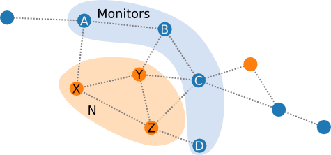
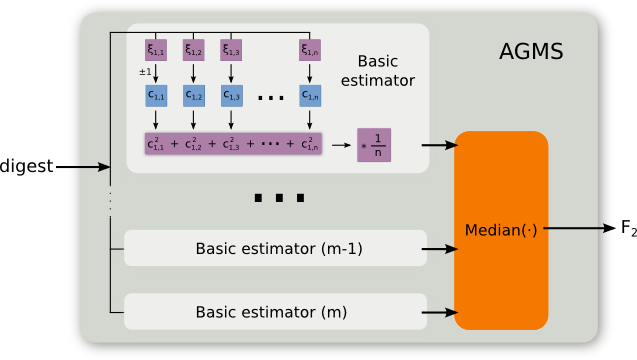

The following pages study the behavior of sketches for traffic validation:

* [Sketches' accuracy when estimating the number of dropped packets](estimating-total)
* [Sketches' accuracy when estimating the ratio of dropped packets](estimating-ratio)
* [Sketches cost in terms of CPU, memory and network overhead](cost)

## What is traffic validation?

Traffic validation is the process of assessing the forwarding behavior of a network area by means of comparing the traffic flows that enter and leave that area.  
The easiest way to implement traffic validation is using the conservation of the flow principle, which states that _the traffic flow entering a network area should be approximately the same as the traffic flow leaving it, without considering the traffic destined to or originated from that network area_; i.e. the incoming traffic should be approximately equal to the outgoing traffic.  

For instance, in the figure above, nodes A, B, C and D will monnitor all the traffic sent and received from X, Y and Z. Then, they will share their traffic summaries, and by comparing them,  we can determine the number of packets that are different between the two traffic flows; e.g. if a packet is present in the incoming traffic but not in the outgoing traffic, then it has been drop by some link or node of N. With this information we can classify N as misbehaving if it drops more than a certain threshold of packets or more than a given proportion of the packets.

## What are sketches and how can they be useful for traffic validation?

A sketch is a data structure that is capable of summarizing a data stream while still being able to estimate its second frequency moment. Essentially, a sketch is a matrix of counters that is updated for every new data stream (traffic packets in our case) by using a set of pseudo-random functions that depend on the type of sketch. Some of the nice properties of sketches that make them a good choice for summarizing traffic in the context of traffic validation are:

* __Online updates:__ we do not need to memorize all the packets seen so far to create the sketch that represents them, but just start from an empty sketch and update it every time we see a new packet.
* __Distributed:__ sketches support linear combination, therefore each monitor can keep its local version of the incoming and outgoing traffic sketches and later they can be combined to obtain the sketch that will represent the global incoming and outgoing traffic.
* __Reduced space:__ a sketch does not require much space to store large traffic streams. Which is good, as we will need to send them through the network.
* __Unique packets:__ in the case of traffic, because packets are mostly unique, we can use the second frequency moment of the traffic as an estimation of the first frequency moment, i.e. the number of packets.

Therefore, an sketch kind of similar to keeping a counter of the number of packets sent and received so far, with the difference that they will allow us to distinguish between the packets themselves.

On our evaluation, we will consider three types of sketches: AGMS, Fast-AGMS and FastCount.

### AGMS

The AGMS sketch is inspired by the tug-of-war game, where each packet is randomly assigned a team, and the rope displacement is used as a prediction for the second frequency  moment. This is achieved by updating each counter using an independent +-1 4-wise pseudo-random function.

### Fast-AGMS

However, because the AGMS sketch needs to update every counter, it can be quite slow when the number of counters is big. To solve this issue, Fast-AGMS was proposed, which first selects a single counter to update per row using a 2-way hash function and later that counter is updated using the +-1 4-wise pseudo-random function.

### FastCount

In paralel, FastCount was proposed, which is similar to the Fast-AGMS sketch, but instead of using a 2-way hash function, it uses a 4-way hash function, and always increases by 1 the counter. As a consequence, the estimator is slightly more complicated.

