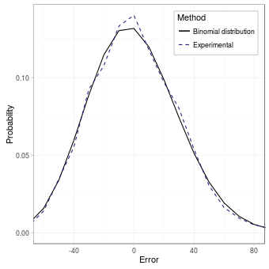
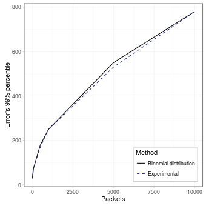
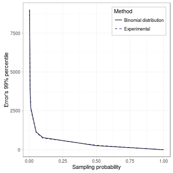
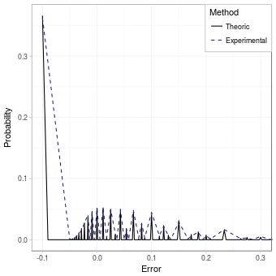
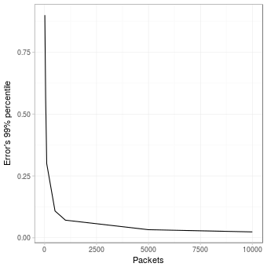
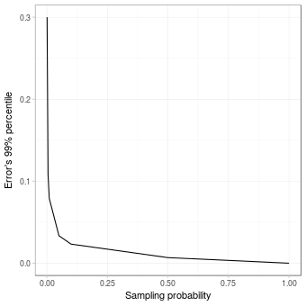

Sampling is one of the simplest mechanisms for summarizing traffic. It consists on keeping just a proportion of the traffic packets as a representation of the whole traffic stream. This is usually achieved by obtaining a digest of the packet and using a function, _probe(digest)_, that determines whether the packet should be sampled or not. A simple _probe_ function could be to compare the digest with a threshold and store the digest if it is below the threshold, drop it otherwise. However, because in such case, every node in the network would know which packets are to be sampled and which are not, a faulty node may behave differently depending on that fact. Therefore, the _probe_ function should not only depend on the digest, but also on a secret key, unknown by the monitored nodes, but known by the monitors, as they have to agree on the same key so that the summaries are consistent. 

When estimating the number of packets of a data stream, the distribution of the estimation and the error follow a binomial distribution. If we are using sampling to estimate the proportion of dropped packets, its distribution is slightly more complicated, as we will see in the figures below.

## Estimating the number of packets

To study the accuracy of sampling we have used the script _sampling.py_, which reads a pcap, simulates the process explained by the figure above. To obtain the data for the following figures run the following command:


# Point to your pcap
pcap=../pcaps/equinix-chicago.dirB.20130529-135900.UTC.anon.pcap 
for ID in {1..100}
do
  python sampling.py total.$ID $pcap --samplingProbability PSAMPLING \
  --numPackets PACKETS
done


### Distribution of the error

The distribution of the error, as mentioned previously follows a binomial variable, for instance, if we run the script with the following parameters:

|              Parameter | Value |
|-----------------------:|:-----:|
|              _Packets_ |  100  |
| _Sampling probability_ |  0.1  |

We obtain the following PMF:

### Effect of the number of packets

For a given sampling probability, if we increase the number of packets, the number of sampled packets will also increase, providing more accurate predictions:

|              Parameter |              Value              |
|-----------------------:|:-------------------------------:|
|              _Packets_ | {10,50,100,500,1000,5000,10000} |
| _Sampling probability_ |               0.1               |

The deviation of the error declines with the square root of the number of packets.

### Effect of the sampling probability

On the other hand, for a fixed number of packets, if we increase the sampling probability, the estimation will also be more accurate: 

|              Parameter |                   Value                  |
|-----------------------:|:----------------------------------------:|
|              _Packets_ |                    100                   |
| _Sampling probability_ | {0.001, 0.005, 0.01, 0.05, 0.1, 0.5, 1.} |

|              Parameter |                   Value                  |
|-----------------------:|:----------------------------------------:|
|              _Packets_ |                  10000                   |
| _Sampling probability_ | {0.001, 0.005, 0.01, 0.05, 0.1, 0.5, 1.} |

The deviation of the error declines approximately with the inverse of the square root of the sampling probability.

## Estimating the proportion of dropped packets

Similarly, if we want to estimate the ratio of dropped packets, we use the same script with some additional parameters:


# Point to your pcap
pcap=../pcaps/equinix-chicago.dirB.20130529-135900.UTC.anon.pcap 
for ID in {1..100}
do
  python sampling.py total.$ID $pcap --samplingProbability PSAMPLING \
  --numPackets PACKETS --ratio --dropProbability PDROP
done


### Distribution of the error

As we have metioned before, the distribution of the error is now slightly more complicated, since it equivalent as a two phase sampling mechanism, so the estimation of the proportion will depend both on the number of sampled packets and the number of those that have been dropped. We can see below the distribution for the error for the following paramters:

|              Parameter | Value |
|-----------------------:|:-----:|
|              _Packets_ |  100  |
| _Sampling probability_ |  0.1  |
| _Dropping probability_ |  0.1  |

As the number of packets increases, the distribution of the error starts resembling a Gaussian distribution centered at 0:

|              Parameter | Value |
|-----------------------:|:-----:|
|              _Packets_ |  1000 |
| _Sampling probability_ |  0.1  |
| _Dropping probability_ |  0.1  |

### Effect of the number of input packets

If we keep every other variable fixed, and make the interval longer, i.e. composed of more packets, we will obtain more reliable estimations, since there will be more samples:

|              Parameter |              Value              |
|-----------------------:|:-------------------------------:|
|              _Packets_ | {10,50,100,500,1000,5000,10000} |
| _Sampling probability_ |               0.1               |
| _Dropping probability_ |               0.1               |

The standard error decreases again inversely proportional to the square root of the number of packets.

### Effect of the sampling probability

Then, we study the effect of different sampling probabilities keeping the other variables fixed. Again, as the sampling probability increases, the estimation is more accurate; and, when the number of packets is big, the standard error is inversely proportional to the square root of the sampling probability.

|              Parameter |                  Value                  |
|-----------------------:|:---------------------------------------:|
|              _Packets_ |                  10000                  |
| _Sampling probability_ | {0.001, 0.005, 0.01, 0.05, 0.1, 0.5, 1} |
| _Dropping probability_ |                   0.1                   |

### Effect of the drop probability

Finally, the value being estimated, the probability of dropping a packet, also influence the accuracy of the estimation:

|              Parameter |                        Value                        |
|-----------------------:|:---------------------------------------------------:|
|              _Packets_ |                         1000                        |
| _Sampling probability_ |                         0.1                         |
| _Dropping probability_ | {0.05, 0.1, 0.2, 0.3, 0.4, 0.5, 0.6, 0.7, 0.8, 0.9} |

